# Architecture

```mermaid
classDiagram

    %% ──────────────────────────────────────────────
    %% Phaser-provided base classes
    %% ──────────────────────────────────────────────
    class `Phaser.Scene` {
        <<Phaser>>
    }
    class `Phaser.GameObjects.Image` {
        <<Phaser>>
    }
    class `Phaser.Physics.Arcade.Sprite` {
        <<Phaser>>
    }

    %% ──────────────────────────────────────────────
    %% Scene classes
    %% ──────────────────────────────────────────────
    class LandingScene {
        +preload()
        +create()
    }

    class SceneFlowPrototype {
        +create()
    }

    class MainMenu {
        +makeLeaves(num, size)
        +create()
    }

    class LevelSelect {
        +makeLeaves(num, size)
        +create()
    }

    class IntroCinematic {
        +shatter()
        +init()
        +preload()
        +create()
        +update()
    }

    class LeafTransition {
        +preload()
        +create(data)
    }

    class Settings {
        +toggleMusic()
        +toggleSFX()
        +create()
    }

    class Pause {
        +create(data)
    }

    class Credits {
        +create(data)
    }

    class EndScene {
        +init(data)
        +create()
    }

    class GameplayPrototype {
        +init(data)
        +updateItemText()
        +flipToFuture()
        +flipToPast()
        +create()
        +update()
    }

    class GameplayPrototypeLevel2 {
        +init(data)
        +flipToFuture()
        +flipToPast()
        +create()
        +update()
    }

    class GameplayPrototypeLevel3 {
        +init()
        +flipToFuture()
        +flipToPast()
        +create()
        +update()
    }

    %% ──────────────────────────────────────────────
    %% Collectible prefabs (defined inside create())
    %% ──────────────────────────────────────────────
    class Collectible {
        +getInventory()
        +gainItem(item)
    }

    class TrashInfo {
        +getInventory()
    }

    class TreasureInfo {
        +getInventory()
    }

    %% ──────────────────────────────────────────────
    %% Physics sprite prefabs (Level 3)
    %% ──────────────────────────────────────────────
    class Rock {
        +setupCollider(collidingObj, offBool, propName)
    }

    class Teleporter {
    }

    %% ──────────────────────────────────────────────
    %% Inheritance relationships
    %% ──────────────────────────────────────────────
    `Phaser.Scene` <|-- LandingScene
    `Phaser.Scene` <|-- SceneFlowPrototype
    `Phaser.Scene` <|-- MainMenu
    `Phaser.Scene` <|-- LevelSelect
    `Phaser.Scene` <|-- IntroCinematic
    `Phaser.Scene` <|-- LeafTransition
    `Phaser.Scene` <|-- Settings
    `Phaser.Scene` <|-- Pause
    `Phaser.Scene` <|-- Credits
    `Phaser.Scene` <|-- EndScene
    `Phaser.Scene` <|-- GameplayPrototype
    `Phaser.Scene` <|-- GameplayPrototypeLevel2
    `Phaser.Scene` <|-- GameplayPrototypeLevel3

    `Phaser.GameObjects.Image` <|-- Collectible
    Collectible <|-- TrashInfo
    Collectible <|-- TreasureInfo

    `Phaser.Physics.Arcade.Sprite` <|-- Rock
    `Phaser.Physics.Arcade.Sprite` <|-- Teleporter

    %% ──────────────────────────────────────────────
    %% Composition / usage relationships
    %% ──────────────────────────────────────────────
    GameplayPrototype ..> TrashInfo : instantiates
    GameplayPrototype ..> TreasureInfo : instantiates
    GameplayPrototypeLevel2 ..> TrashInfo : instantiates
    GameplayPrototypeLevel2 ..> TreasureInfo : instantiates
    GameplayPrototypeLevel3 ..> Rock : instantiates
    GameplayPrototypeLevel3 ..> Teleporter : instantiates
```

## Scene overview

| Class | File | Scene key | Role |
|---|---|---|---|
| `LandingScene` | `landing-scene.js` | `landing-scene` | Landing Scene to Let Audio Play in Intro by forcing player interaction with webpage|
| `SceneFlowPrototype` | `Scene-Flow.js` | `scene-flow` | scene flow prototype display |
| `MainMenu` | `Main-Menu.js` | `main-menu` | Main menu letting player access levels, settings, and credits |
| `LevelSelect` | `Level-Select.js` | `level-select` | Lets player select level |
| `IntroCinematic` | `Intro-Cinematic.js` | `intro-cinematic` | Animated team studio intro |
| `LeafTransition` | `leaf-Transition.js` | `leaf-transition` | leaf sweep scene transition |
| `Settings` | `Settings.js` | `settings` | Music / SFX toggles backed by `localStorage` |
| `Pause` | `Pause.js` | `pause` | Pause overlay launched over a gameplay scene |
| `Credits` | `Credits.js` | `credits` | Game Credits |
| `EndScene` | `End-Scene.js` | `end-scene` | Win/end scene |
| `GameplayPrototype` | `Core-Gameplay.js` | `core-gameplay` | Level 1 — time-travel lever, collectibles |
| `GameplayPrototypeLevel2` | `Core-Gameplay-Level2.js` | `core-gameplay-level2` | Level 2 — same mechanic set as Level 1 |
| `GameplayPrototypeLevel3` | `Core-Gameplay-Level3.js` | `core-gameplay-level3` | Level 3 — adds `Rock` and `Teleporter` prefabs |

## Prefab / game-object classes

| Class | Extends | Defined in | Purpose |
|---|---|---|---|
| `Collectible` | `Phaser.GameObjects.Image` | `Core-Gameplay*.js` (local to `create()`) | Abstract interactive pickup; handles `gainItem` logic and fade-in tooltip |
| `TrashInfo` | `Collectible` | `Core-Gameplay*.js` | Concrete trash pickup; writes to `scene.trashInventory` |
| `TreasureInfo` | `Collectible` | `Core-Gameplay*.js` | Concrete treasure pickup; writes to `scene.treasureInventory` |
| `Rock` | `Phaser.Physics.Arcade.Sprite` | `Core-Gameplay-Level3.js` | Static breakable rock with per-object collider helper (`setupCollider`) |
| `Teleporter` | `Phaser.Physics.Arcade.Sprite` | `Core-Gameplay-Level3.js` | Warp trigger that repositions the player to a target coordinate |
